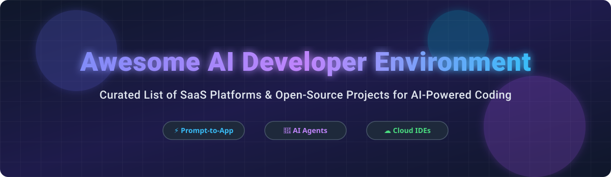

  

# 🚀 Awesome AI Developer Environment

    

> **Curated List of SaaS Products & Open-Source GitHub Projects for AI Developer Environments, Prompt-to-App Builders, Cloud IDEs & AI-Native Development.**

---

## 📑 Table of Contents

- [💡 Overview](#-overview)
- [🏢 SaaS & Hosted Platforms](#-saas--hosted-platforms)
- [🔓 Open-Source GitHub Projects](#-open-source-github-projects)
- [📈 Star History](#-star-history)
- [🤝 How to Contribute](#-how-to-contribute)
- [💖 Support & Sponsorship](#-support--sponsorship)
- [⚠️ Disclaimer](#%EF%B8%8F-disclaimer)

---

## 💡 Overview

This repository tracks notable **SaaS platforms** and **open-source projects** in the **AI Developer Environment** ecosystem. These tools enable developers, product managers, and designers to transition from natural language prompts to running applications using cloud IDEs, autonomous AI agents, and instant sandboxes.

---

## 🏢 SaaS & Hosted Platforms

> 📊 **Market Size & Structure**: The Global AI Developer Tools and Cloud Development Environment market is estimated at **~$15 Billion to $22 Billion** (2025–2026) with rapid growth projections. The sector is currently **moderately fragmented**, featuring high competition among tech giants (Microsoft/GitHub, Google/Firebase, Vercel) and venture-backed hyper-growth startups (Cursor, Lovable, Replit, StackBlitz).

The SaaS table below is sorted by **Company Size / Valuation / Revenue (Descending)**:

| Product Name 🛠️ | Company Size / Valuation / Revenue 💰 | Starting Paid Price 🏷️ | Free Tier / Trial Limits 🎁 | Description & Key Features 📝 |
| :--- | :--- | :--- | :--- | :--- |
| **[GitHub Copilot Workspace](https://github.com/features/copilot)** | Parent Microsoft (~$3.1T Valuation); GitHub ~$2B+ ARR | $10/user/month (Copilot Individual) | 30-day free trial for Copilot Individual | Copilot-native environment that converts GitHub Issues to PRs with automated planning, Codespaces compute, and auto-validation. |
| **[Firebase Studio](https://studio.firebase.google.com/)** | Parent Alphabet/Google (~$2.0T Valuation) | $0 Pay-as-you-go (Blaze plan usage) | Free Spark Plan with generous no-cost monthly quotas for Firebase & Gemini API free tier | Agentic cloud IDE with Gemini AI agents, multimodal prompting, Next.js app prototyping agent, and seamless Firebase hosting integration. |
| **[v0 by Vercel](https://v0.dev/)** | Vercel ($3.25B Valuation) | $20/user/month (Premium) | Free tier includes $5 monthly credit allowance (~200 credits) | AI app builder generating full React/Next.js code from prompts with live Vercel Sandbox preview URLs and programmatic API access. |
| **[Cursor](https://cursor.com/)** | Anysphere ($2.5B Valuation) | $20/user/month (Pro) | Free plan includes 14-day Pro trial + 50 slow premium requests/month | AI-first VS Code fork featuring Composer multi-file agent for cross-file refactoring, terminal execution, and deep codebase indexing. |
| **[CodeSandbox](https://codesandbox.io/)** | Acquired by Together AI ($1.25B Valuation) | $15/user/month (Pro) | Free plan includes unlimited public & private microVM sandboxes (2 vCPU, 2GB RAM limits) | Cloud microVM environment using Firecracker for 1.5s cold starts, instant cloning, collaborative terminals, and Together AI code execution SDK. |
| **[Lovable](https://lovable.dev/)** | $1.8B+ Valuation (Hyper-growth startup) | $20/month (Starter) | Free plan includes 5 build credits per day (up to 30 credits/month) | Natural language prompt-to-production web app builder with version history, instant deployment URLs, and collaborative team workspace options. |
| **[StackBlitz / Bolt.new](https://bolt.new/)** | StackBlitz (~$200M+ Valuation) | $18/user/month (Pro) | Free tier includes unlimited public projects & free hosting at `bolt.host` (10GB bandwidth, 333k requests/mo) | Browser-based fullstack dev environment powered by WebContainers (Wasm Node.js in browser), featuring Bolt.new prompt-to-app builder and Plan Mode. |

---

## 🔓 Open-Source GitHub Projects

The Open-Source projects below are sorted by **GitHub Stars (Descending)**:

| Project Name 📦 | GitHub Stars ⭐ | License 📜 | Category 🗂️ | Key Highlights 🌟 |
| :--- | :--- | :--- | :--- | :--- |
| **[OpenHands](https://github.com/All-Hands-AI/OpenHands)** |  | MIT | Autonomous AI Software Engineer | Open-source platform (formerly OpenDevin) capable of editing code, running terminal bash commands, browsing the web, and resolving GitHub issues. |
| **[code-server](https://github.com/coder/code-server)** |  | MIT | Remote Web IDE | Runs VS Code on any remote Linux/cloud server and serves it securely through any web browser tab. |
| **[gpt-engineer](https://github.com/AntonOsika/gpt-engineer)** |  | MIT | Code Generation CLI & Framework | Generates an entire codebase from a single prompt, allowing customization and learning from user feedback. |
| **[aider](https://github.com/Aider-AI/aider)** |  | Apache-2.0 | Terminal AI Pair Programmer | Command-line AI pair programmer that pairs with local git repos, edits multiple files, and automatically creates structured git commits. |
| **[Dyad](https://github.com/dyad-sh/dyad)** |  | Apache-2.0 | Local AI App Builder | Desktop-first, local, private open-source alternative to Bolt.new and Lovable with Bring-Your-Own-API-Keys (BYOK) support. |
| **[OpenVSCode Server](https://github.com/gitpod-io/openvscode-server)** |  | MIT | Browser VS Code Server | Upstream VS Code server distribution by Gitpod, optimized for lightweight container deployments (~1GB RAM). |

---

## 📈 Star History

---

## 🤝 How to Contribute

Contributions are welcome and appreciated! Follow these steps to submit a tool or update:

1. Fork the repository.
2. Add or update entries in `README.md` following the exact table structure.
3. Ensure pricing, free tier limits, star badges, and links are accurate.
4. Submit a Pull Request with a short summary of changes.

For curated lists guidelines, visit [Awesome Awesome Awesome](https://github.com/ishandutta2007/Awesome-Awesome-Awesome).

---

## 💖 Support & Sponsorship

If you find this repository helpful for evaluating or building AI developer environments, please consider supporting the project:

- ⭐ **Star this repository** to help others discover it!
- 🔀 **Fork** and contribute updates or new tools.
- 📢 **Share** with developers and engineering teams.
- ☕ **Buy me a coffee / Sponsor**: [GitHub Sponsors - ishandutta2007](https://github.com/sponsors/ishandutta2007)

Thank you for your support! ❤️

---

## ⚠️ Disclaimer

- This repository is a community-curated collection for educational and informational purposes.
- Product logos, trademarks, and brand names belong to their respective owners.
- When evaluating AI developer tools, review data privacy, security policies, and API token usage before connecting private repositories.
